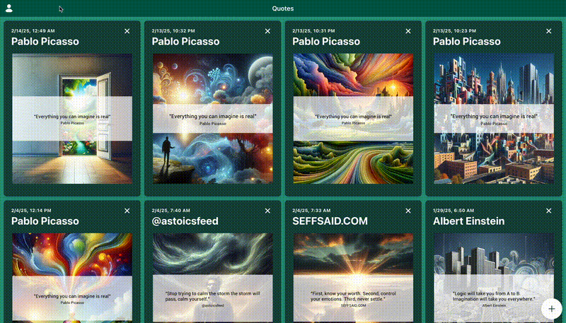

import ApiLogo from "@theme/ApiLogo";
import Heading from "@theme/Heading";
import SchemaTabs from "@theme/SchemaTabs";
import TabItem from "@theme/TabItem";
import Export from "@theme/ApiExplorer/Export";

<Heading
  as={"h1"}
  className={"openapi__heading"}
  children={"Hey Quotey API"}
>
</Heading>

Hey Quotey provides a simple API that allows you to generate images containing quotes. To use the API, you need to generate an API key. To make an authenticated request, include the API key in the `X-Hey-Quotey-API-Key` header.

### Generating API Keys

1. Navigate to the [Account](https://heyquotey.com/home/account) page.
2. Click the ⊕ button under the "API Keys" section.
3. Click the "Copy" button to copy the API key to your clipboard.

  <Heading
    id={"authentication"}
    as={"h2"}
    className={"openapi-tabs__heading"}
    children={"Authentication"}
  >
  </Heading><SchemaTabs
    className={"openapi-tabs__security-schemes"}
  >
    <TabItem
      label={"API Key: ApiKeyAuth"}
      value={"ApiKeyAuth"}
    >
      
      
      
      
      

        <table>
          <tbody>
            <tr>
              <th>
                Security Scheme Type:
              </th><td>
                apiKey
              </td>
            </tr><tr>
              <th>
                Header parameter name:
              </th><td>
                X-Hey-Quotey-API-Key
              </td>
            </tr>
          </tbody>
        </table>
      

    </TabItem>
  </SchemaTabs>

      